# Day 2

## Abstraction

1. OpenStack 관련 간단한 각 서비스에 대한 리뷰
2. 실습을 위한 OS 재설치
   - 6.X -> 7.X 최신버전 (1803)

## OpenStack Review

### Services

#### 기본 서비스

- NOVA: Compute Service, 사용 VM은 보통 KVM을 활용.
- IRONIC: Baremetal Service
- SWIFT: Object Stroage (like AWS S3)
- Cinder: Block Storage, Ceph와 같은 서비스와 연동해서 사용 가능
- Neutron: Network, DHCP, Floating IP 관리를 위한 서비스
- Keystone: Identity Service
- Glance: OS Image 관련 서비스
- Horizon: Web 기반 Dashboard 서비스.

#### 기타 서비스

##### Octavia

- 기존 Neutron 자체 LBaaS 관련 부하가 커서 OCTAVIA 새로 추가.
- Load Balancer를 Instance로 구성하여 Scale out에 유리.

##### Barbican

- Key Manager Service
- passphrase, 암호화 키, X.509 인증서 등에 대한 저장 및 Provisioning 용
  RESTful API 제공
- SSL 연동용도로 활용.

##### Heat & AODH

- Heat: Template 기반 Ochestration 서비스
- Aodh: Telemetry Alaming Service
- Heat에서 임계치를 설정. Aodh에서 발생한 Alarm에 대해 Auto scaling를 처리할 수
  있도록 지원.

##### Ceilometer

- 오픈스택내 사용량 모니터링 도구. CPU/Memory/Network/IO 관련 사용량 체크 지원.
- 기존 MongoDB에서 시계열 DB서비스인 Gnocchi로 변경

##### Rally

- 다중노드에 대한 OpenStack의 배치/검증/벤치마킹 및 프로파일링 자동화 툴.

##### Magnum

- Openstack 내 Container 서비스 관리를 위한 서비스

### 구성

#### Ctrl 구성

- Ctrl (Neutron, Keystone 등...) 관련된건 HA로 구성하지만 부하에 따라 분산
  구성 가능
  - 보통 DB의 부하가 큼. 분산구성해도 각 서비스가 RabbitMQ를 통해 Communication
    하기 때문에 문제가 적음.
- HA 구성시 Quorum 방식으로 사용 => 홀수로 늘어나는 쪽이 괜찮음.

#### Network 구성

4개의 Network 망으로 구성. 각 용도에 따라 분리시켜 영향성을 줄임.

- 순수 관리용망 1개
- API통신을 위한 망 1개
- Guest의 Out Traffic을 위한 망 1개
- Compute 끼리 통신하기 위한 Guest 망

## OS 재설치 방법

### 0. Prerequisite

- IPMI Client 실행을 위한 JRE가 설치되어야 함.
- 서버에 접속하여 아래 정보들을 반드시 확인해서 기록
  - **DNS**: /etc/resolv.conf
  - **IP/Netmask/Gateway**: /etc/sysconfig/network-script/ifcfg-eth0
  - **Hostname**: `hostname` 실행

### 1. Cafe24에서 IPMI 설정 Open

#### 1) 서버 임시 접속 정보 확인

`로그인->나의서비스관리->서비스 사용현황` 에서 `서버 임시 접속 정보` 확인

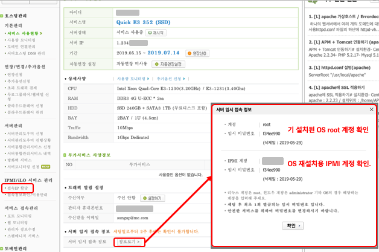

최초 서버 시작 후 2주내에 확인 불가능해지기 때문에 바로 확인 후 정보 변경. 우선
서버의 로그인 정보 확인해서 **DNS, IP, Gateway, Hostname** 정보를 밭드시 확인.

#### 2) IPMI 접속 활성화 및 접속

왼쪽 메뉴탭에서 `IPMI/iLO 서비스 관리->접속IP 할당`으로 가서 설정하기 클릭. 단,
서버 설치 및 셋팅 시 1시간 이상 걸릴 수 있기 때문에 2~3시간 정도로 허용시간
설정.

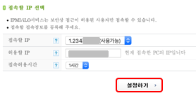

이후 IPMI 접속정보 페이지에서 접속하기 클릭. 이 경우 Supermicro의 IPMI 로그인
화면으로 이동하며 여기서 `서버 임시 접속 정보`에서 확인한 IPMI 로그인 정보로
로그인.

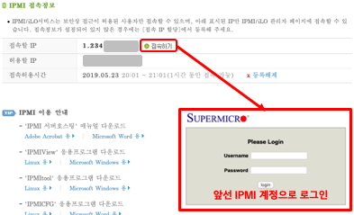

로그인 후, `Remote Control->Console Redirection`로 이동해 `Launch Console`을
클릭. 클릭 시 `launch.jnpl`파일을 다운로드 받게 되며, 다운받은 파일을 java를
사용해서 실행.

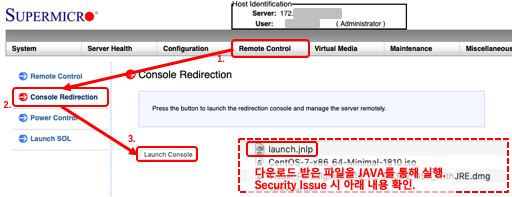

단, 아래 JAVA 관련 이슈가 나올 수 있음

- Supermicro IMPI 페이지 이동시 JRE 업데이트 메시지가 나오나, 최신 브라우저에서
  지원하지 않기 때문에 무시함.
- `launch.jnlp` 실행 시 Security 관련 팝업이 나옴. 아래 Supermicro의 QnA를 보고
  해결
  - [Every time I refresh IPMI web page I get...](https://www.supermicro.com/support/faqs/faq.cfm?faq=21544)

#### 3) IPMI를 통해 CentOS 7 설치 ISO로 부팅

우선 [CentOS](https://www.centos.org/download/)에서 최신버전 CentOS 다운로드.
설치 시 시간 단축을 위해 `Minimal ISO` 버전으로 다운로드 함. 다운로드 후 IMPI
Client에서 `Virtual Storage`를 클릭해서 아래와 같이 다운로드 받은 ISO 파일을
연결함. 단, 최종적으로 `Plug In`을 클릭해야 ISO 파일이 마운트됨. 추가로, 설치
중 네트워크가 끊기는 경우 ISO 파일도 같이 풀리기 때문에 처음부터 다시 해야 함.

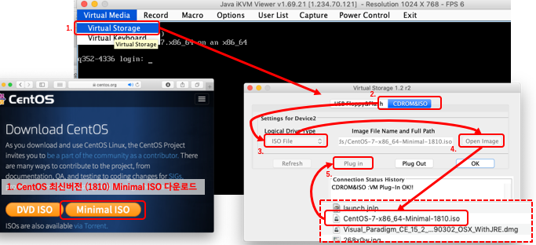

서버를 재 부팅시킨 후 `F11`키로 Boot Menu로 이동. `IPMI Virtual CDROM 3000`
선택 해 방금 Mount한 CD Image로 부팅하면 CentOS 인스톨 화면이 뜨는데 이때,
`Install CentOS 7`를 선택. (아니면 다운받은 Image를 모두 검사하기 때문에 설치
시간이 더 오래 걸림)

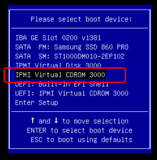 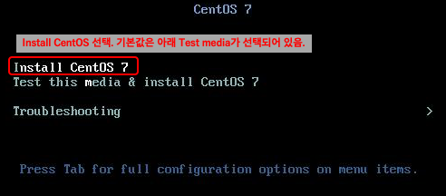

#### 4) CentOS 7 설치

설치화면에서 아래와 같이 `Network & Hostname` -> `Date & Time` ->
`Installation Destination` 순서로 설정. (NTP 정상동작을 위해서는 Network가
우선 설정이 되어야 함). 필요 시 Kdump를 Disable 시켜도 상관없음.

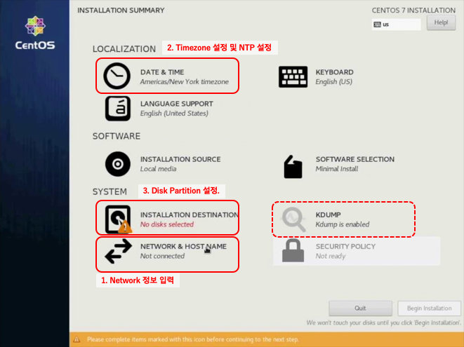

##### (1) Network & NTP 구성

Network & Host Name 화면에서 앞서 확인했던 Hostname 이름 입력. Network Device
중, 연결되지 않은 포트는 ***unplugged***로 표시 되기 때문에 그렇지 않은
포트의 Ethernet을 선택해서 `Configure...`를 클릭.

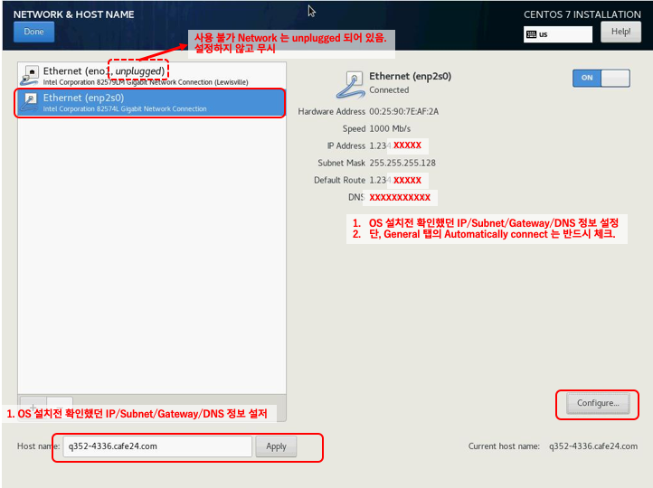

General 탭에서 `Automatically connect to this network when it is available`의
체크박스를 체크.

IPv4 Setting 탭에서 `Method`를 `Manual`로 설정하고, Address 정보를 입력. 이때
앞선 확보한 Netmask 값을 입력하면 자동적으로 2자리수로 바뀜. (IP의 Bit width)
`DNS servers` 값을 입력여부는 선택이나, 설치시 셋팅하지 않은 경우 설치 후
`/etc/resolv.conf`에 직접 nameserver를 입력해야 함.

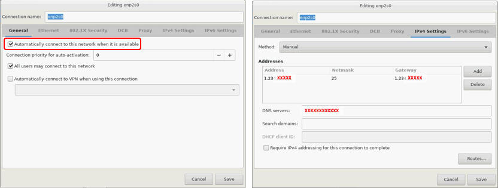

네트워크 정보가 정상적으로 `Connected`인지 확인 후 `Date & Time`에서
`Network Time`이 **On**이 되어 있는지 확인, Timezone도 Seoul로 변경.

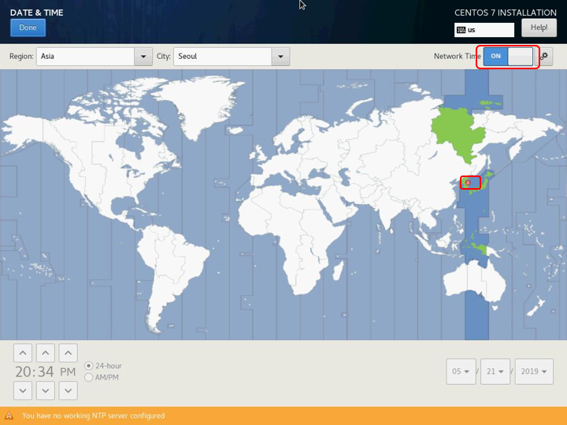

##### (2) Installation Destination 설정

하기 동영상 참고

<iframe width="560" height="315" src="https://www.youtube.com/embed/_V0hKTDDfsI" frameborder="0" allow="accelerometer; autoplay; encrypted-media; gyroscope; picture-in-picture" allowfullscreen></iframe>

Inatallation Destination을 선택. `Disk Selection`에서 **SSD만** 선택. 선택 후
`Other Storage Option`에서 **`I will configure partitioning.`**을 반드시 선택.

우선, 기존에 할당된 모든 Partition들을 모두 삭제함. 이후 `Create New Partition`
을 `LVM`에서 `Standard Partition`으로 변경하고
`Click here to create them automatically`를 선택. 이때 자동 생성된 파티션에서
Data 영역의 `/home` 디렉토리가 대부분의 용량을 갖고 가기 때문에 `/home`
파티션을 우선 제거. 이후 `/` 디렉토리를 선택해 `Desired Capacity`의 내용을
**깨끗하게 지운** 다음 `Update Settings`을 클릭하면 방금 지운 `/home`
디렉토리 용량을 모두 root 디렉토리로 돌려지게 됨.

##### (3) Install 실행

셋팅을 완료하고 `Begin Installation`으로 설치 시작. 설치 진행중에 root 계정의
암호를 설정.

설치 완료 후 재부팅해서 정상적인 Login 및 ssh 접속이 가능한지 확인. 이후,
`yum update -y && reboot`로 최신 업데이트 설치 후 재 부팅.