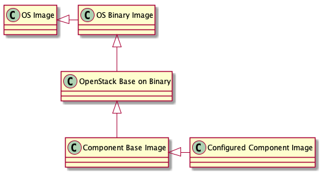

# Overview

## StarlingX (김호진님)

### K8s on OpenStack on K8s

- OpenStack (인프라 제공)
  - HW Vendor 들이 OS 주도권 유지를 위해 다양한 Plug-in 제공
  - 다양한 HW 활용 가능.
  - AWS 형태의 서비스 제공
- K8s (언제 어디서나 어플리케이션 사용)
  - 플랫폼 배포에 최적화
  - Application 개발자들이 주도해서 개발
    - Pros: App 배포/모니터링/스케일업에 최적화
    - Cons: Infra 고민이 적음.
  - HW Plugin에 대한 지원의 한계 존재.
  - Google 형태의 서비스 제공.
- 오픈스택 as a application on k8s
  - OpenStack 운영을 위한 솔루션들을 K8s의 Application으로 활용
  - 자동복구 및 가용성에서 장점.

### starlingX

- Intel 에서 Edge computing을 위해 WindRiver Titanium Cloud 활용
  - Titanium Cloud 솔루션을 흡수한 후 오픈소스로 오픈
- Edge Cloud 구축
  - 가상화 플랫폼의 손쉬운 배치와 자동화...
  - IoT와 가상 플랫폼의 관리에 초점.
- Base환경은 ubuntu.

### Features
  
- Service/Fault/Software/Bare Metal/Platform, etc...
- Deploy option: All-in-one, Standard Controller, Others
- 일반적으로는 y/n만 입력하면 가능한 정도.

### 배포방식

- ISO를 빌드하고 PXE로 배포해서...
  - 기본적으로는 largest green build를 활용.
- StarlingX 구축.
  - docker Container 1개가 ISO파일을 만들어줌.
  - Package Mirror를 생성
  - Package 및 ISO 생성.
- ISO를 바탕으로 Ctrl 생성. 여기서 부터 개별 시스템을 구축.
  - K8s 기바으로 system을 구축.
  - Label을 먹여서 역할을 지정.
  - 이후 OpenStack의 구성요소를 Helm 으로 전체 설치.
    - 버전은 선택해서 설치 가능할 거라고 예상.
- Network 구성이 하나의 Dashboard에서 관리 안됨.
  - Qurio 를 설치해야 제어 동시 제어 가능.

## Kolla/Kolla-ansible (윤찬열님)

### Deploy of OpenStack

- 기존 오픈스택 구축 운영 문제점
  - Scale up 시 Deploy가 가장 어려움
  - Version 관리 및 다수의 가상머신 관리의 문제
- **kolla**
  - openstack 용 이미지 생성 및 손쉽게 배포하기 위한 환경.
  - 각각 기능들을 Container 화 해서 독립적인 배포 가능.
  - Sub-Project: Kolla, Kolla-ansible, Kolla-Cli
  - RedHat, Juniper 등에서도 Kolla 이미지 활용.

### Kolla Image 구조

개별 Component는 Layer화 된 Dockerfile로 구성되어 있음.

1. **OS Binary Image**: 기존 OS Image에 OpenStack을 위한 Repository 설정 추가
2. **OpenStack Base on Binary**: Openstack을 위한 공통 Pakcage들 설치
3. **Component Base Image**: Component의 기본 Package들을 설치
4. **Congigured Component Image**: 개별 Configuration 및 세부 구성요소에 따른
   Component용 최종 실행 이미지 생성

현재 Openstack Stein 버전 Kolla 8.0 Stable Release. Train 버전 Kolla 9.0
개발 진행중. (단, Stable 버전에서도 안정성 문제가 존재.)

### Deploy 환경

1. Kolla/kolla-ansible 프로젝트 clone
2. 개발환경 테스트 및 스크립트 작성 및 테스트
3. 설정/자동화 스트립트 Push
4. Deploy 서버에 설정/자동화 Script Clone
5. Kolla image build
6. RPM/Python Package들에 대해 Local Repository sync
7. Kolla-ansible deploy

Kolla Image를 직접 빌드 할 수 있지만, Doker Hub을 활용하는 쪽이 편할 수 있음.

### HA 구성

Keepalived + HAProxy를 통해 구성. 일반적으로 3개 이상의 홀수개의 Quorum을 구성.

Reference: [Juniper OpenStack High Availability](https://www.juniper.net/documentation/en_US/contrail5.0/topics/task/configuration/juniper-high-availability-vnc-4.0.html)

### Configurations

각 Container 마다 `/etc/kolla/<project-name>/<container-name>` 으로 관리.
설정 파일들이 bind 되어 연결되어 있어, Component간 설정파일이 공유됨.

설정 변경 시 배포서버에서 kolla-ansible을 통해 배포후 재 실행.

### Oher Deploys

Jumbo Frames, SR-IOV, OpenDaylight, OVS-DPDK, NFV, OVN, Ceph, etc...

### Kolla Limitations

Kolla 프로젝트 자체가 집중도가 낮고 Contributor들도 적어 운영 및 프로젝트
진행도가 상대적으로 느림.

- Kolla-k8s 프로젝트도 존재했었으나, 현재는 종료되고 버전업이 안됨
- 현재로는 Openstack-Helm으로 관리되고 있음.
